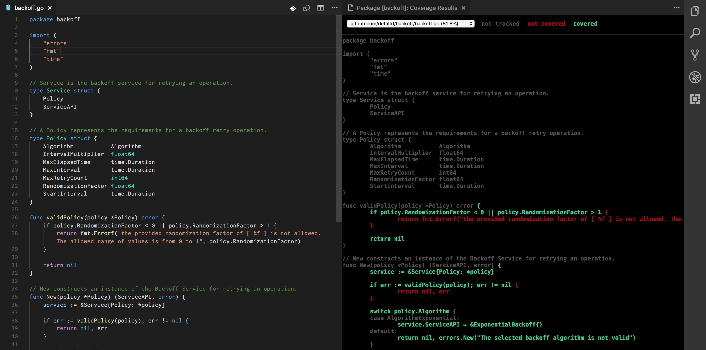

# Go Coverage Viewer

## How to use this extension

1. Open the Command Panel (Mac = cmd+shift+p)
2. Search for "Go Coverage"
3. Select any of our available commands to use

## Features

This extension adds the ability to view your go coverage results within VS Code via a simple command.

## Requirements

This package requires the Go programming language extension for language support. It also requires you to have golang installed on your machine.

-----------------------------------------------------------------------------------------------------------

## License

[MIT](LICENSE "License")
